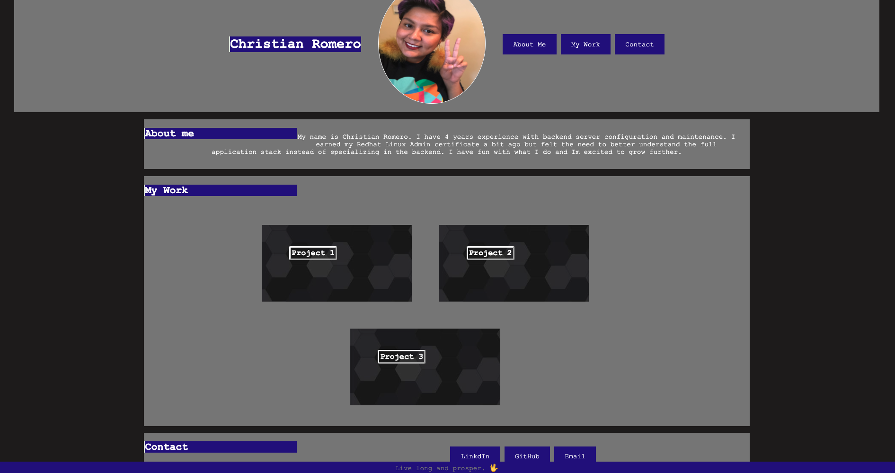

# About Me 

This site is built to convey my personal brand and used as a way to see a brief history of my development experience.

# Basic layout

This page will be built in a one page structure with links to other items that display my work. 
Links are listed at the bottom of the pagge 

[ADD LINKS HERE TOO](https://support.google.com/webmasters/answer/7451184?hl=en)

 [LinkedIn](https://www.linkedin.com/in/christian-romero-rhcsa-4817a7bb) 
 [GitHub](https://github.com/Romer0-c) 
 [Email doesnt work intentionally as a measure of security](mailto:example@email.com)

# HTML Modification

the colors are meant to be dark monochromatic 

# Assets

show a screenshot of the end result: 
[Deployment environment](https://romer0-c.github.io/about_me/)

# Design
show a screenshot of the way it looks when the pixel dimensions are smaller

Its important to recognize the ability to project manage the building of the site too. 
dev work isnt only about the way the site is built but also understanding the project timeline associated with a site. 
ALTHOUGH I DONT HAVE A LOT OF PROJECTS - MAKE SURE TO HIGHLIGHT SKILLS THAT SHOW DEDICATION TO LEARNING AND PROCESS IMPROVEMENT. 

sleak design with only a few colors to help highlight the projects section as the main focal point. 

LEARN MORE ABOUT PROJECT MANAGEMENT FOR A BUILD OF THE SITE TO INCORPORATE INTO THE CONTENT. 

--